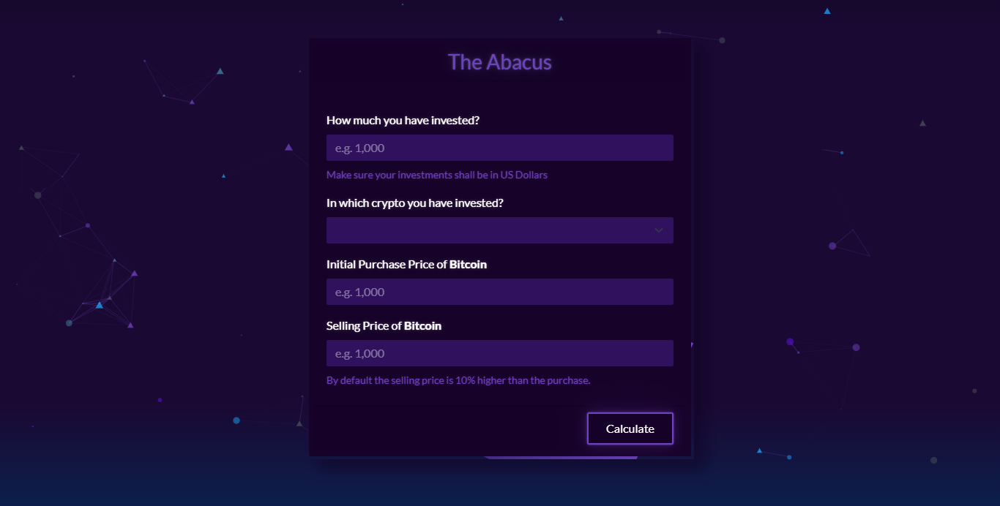

# Assignment 3

### Preamble

Assignment is to develop an interactive and attractive website. Simply, an interactive website is a website that communicates and allows for interaction with users. Interaction doesn't just mean allowing users to “click” and “scroll”. Infact, interactive websites offers content to their users that is amusing and engaging too. [Specbee, August 21, 2019](https://www.specbee.com/blogs/how-make-interactive-websites-and-why-you-need-one "Specbee, August 21, 2019")

The thing that makes a website interactive is the ability for the user to actively engage with the content and various elements. [Ironistic, July 16, 2019](https://www.ironistic.com/insights/interactive-website-design-benefits/ "Ironistic, July 16, 2019")

### Assignment Overview

This assignment is an online Return On Investment (ROI) calculator based on user input. Keeping in view the current trend of crypto-trading this calculator is designed to calculate/predict profit or loss on the invested amount. However, it can be used to calculate any sort of investment in any market.

This basic investment calculator application is built with following technologies, in order to make it more interactive and attractive.

- HTML/CSS/Javascript
- [Bootstrap](https://getbootstrap.com/ "Bootstrap") - An open-source CSS framework.
- [Bootswatch](https://bootswatch.com/ "Bootswatch") - A theme collection for Bootstrap.
- [jQuery](https://jquery.com/ "jQuery") - A fast, small, and feature-rich JavaScript library, designed to simplify HTML DOM tree traversal and manipulation, as well as event handling, CSS animation, and etc.
- [Animate.css](https://animate.style/ "Animate.css") - A cross browser, ready to use css animation library.
- [Select2](https://select2.org/ "Select2") - A jQuery based replacement of select. Mostly used for searchable and multi-select options.
- [Toastr](https://codeseven.github.io/toastr/ "Toastr") - A Javascript library for non-blocking notifications.
- [Tilt JS](https://gijsroge.github.io/tilt.js/ "Tilt JS") - A small easy to use 60+fps requestAnimationFrame powered parallax hover tilt effect for jQuery.
- [Cleave JS](https://nosir.github.io/cleave.js/ "Cleave") - A Javascript library used to format input field in real-time while typing.
- [Particles JS](https://vincentgarreau.com/particles.js/ "Particles JS") - A lightweight JavaScript library used for creating particles which looks likes the vertices of polygon, used for creating background live animation.
- [Coinmarketcap API](https://coinmarketcap.com/ "Coinmarketcap API") - World's most-referenced price-tracking website for cryptoassets in the rapidly growing cryptocurrency space..

Want to see it live? [click here](https://theabacus.netlify.app/ "click here")

### Preview

