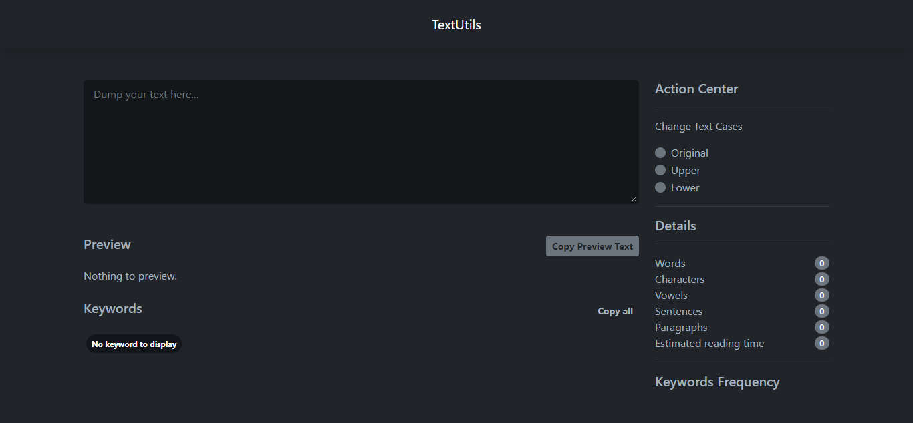

# ReactTextUtils Project

### Overview

TextUtils is simply a set of utility functions to do operations on String objects. This is an app that perform some string operation and displays the result on webpage in realtime using [React JS](https://reactjs.org/ "React JS").

Want to see it live? [click here](https://reacttextutils1.netlify.app/ "click here")

# Getting Started with Create React App

This project was bootstrapped with [Create React App](https://github.com/facebook/create-react-app).

## Available Scripts

In the project directory, you can run:

### `npm start`

Runs the app in the development mode.\
Open [http://localhost:3000](http://localhost:3000) to view it in your browser.

The page will reload when you make changes.\
You may also see any lint errors in the console.

### Deployment

This section has moved here: [https://facebook.github.io/create-react-app/docs/deployment](https://facebook.github.io/create-react-app/docs/deployment)

### Preview

